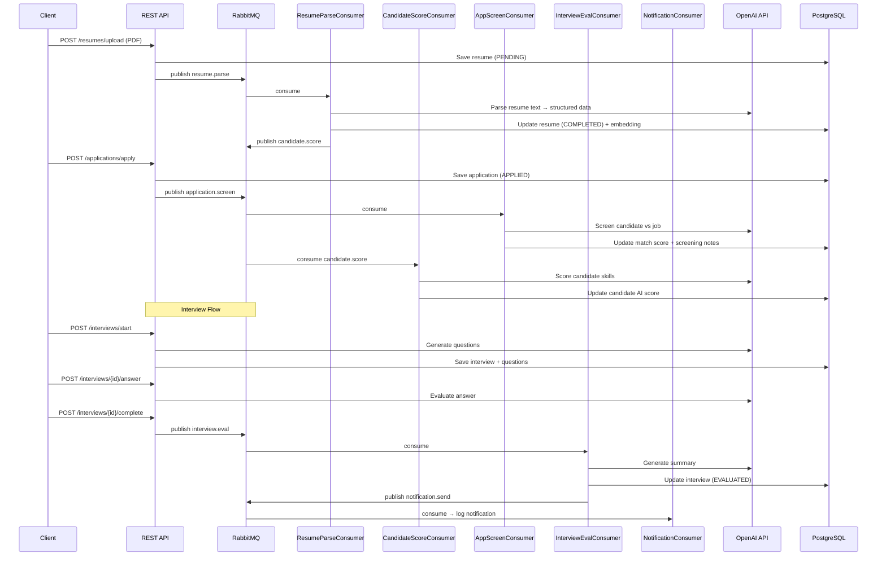

# HireAI — AI-Powered Hiring Platform

An intelligent hiring platform that leverages AI for resume parsing, candidate screening, semantic job matching, and automated interviews. Built with Spring Boot, Spring AI (OpenAI), PostgreSQL with pgvector, RabbitMQ, and Redis.

---

## Architecture

```mermaid
graph TB
    subgraph API Gateway
        SC[Spring Security + JWT]
        RL[Redis Rate Limiter]
    end

    subgraph REST Controllers
        AC[AuthController]
        JC[JobController]
        CC[CandidateController]
        RC[ResumeController]
        APC[ApplicationController]
        IC[InterviewController]
        MC[MatchController]
        DC[DashboardController]
    end

    subgraph Services
        AS[AuthService]
        JS[JobService]
        CS[CandidateService]
        RS[ResumeService]
        APS[ApplicationService]
        IS[InterviewService]
        MS[JobMatchService]
        DS[DashboardService]
    end

    subgraph AI Layer
        RAI[ResumeAIService]
        IAI[InterviewAIService]
        CB[Resilience4j Circuit Breakers]
    end

    subgraph Infrastructure
        PG[(PostgreSQL 16 + pgvector)]
        RD[(Redis 7)]
        RMQ[RabbitMQ 3]
        OAI[OpenAI API gpt-4o-mini]
    end

    UI --> SC --> RL --> REST Controllers
    REST Controllers --> Services
    Services --> PG
    Services --> RD
    Services --> RMQ
    RAI --> CB --> OAI
    IAI --> CB
    MS --> PG
```

## Demo
https://www.loom.com/share/311b5e0ffd274a64bb57b12b536b63fb

## Tech Stack

| Layer | Technology | Version | Purpose |
|-------|-----------|---------|---------|
| Runtime | Java | 21 | Language runtime |
| Framework | Spring Boot | 3.5.10 | Application framework |
| AI | Spring AI + OpenAI | 1.1.2 | Resume parsing, screening, interviews, matching |
| Database | PostgreSQL | 16 | Primary data store |
| Vector Search | pgvector | — | Cosine similarity for semantic job matching |
| Migrations | Flyway | — | Schema version control |
| Cache | Redis | 7 | Response caching, rate limiting |
| Messaging | RabbitMQ | 3 | Async event-driven processing |
| Auth | Spring Security + JJWT | 0.12.6 | JWT (HS384) authentication |
| Resilience | Resilience4j | 2.2.0 | Circuit breakers + retries for AI calls |
| Docs | Springdoc OpenAPI | 2.8.4 | Swagger UI with JWT auth |
| Monitoring | Micrometer + Prometheus | — | Metrics and health checks |
| Doc Parsing | Apache PDFBox / POI | 3.0.3 / 5.3.0 | PDF and DOCX resume extraction |
| Build | Maven | — | Dependency management |
| Containers | Docker Compose | — | Local infrastructure |

## Features

- **JWT Authentication** — Register, login, and token refresh with role-based access (RECRUITER, CANDIDATE, ADMIN)
- **Job Management** — Full CRUD with search/filter by title, location, employment type, experience level
- **Resume Upload & AI Parsing** — Upload PDF/DOCX resumes; AI extracts skills, experience, education asynchronously
- **AI Candidate Screening** — Automated scoring and screening notes when candidates apply to jobs
- **AI Interview Engine** — Generate role-specific questions, evaluate answers in real-time, produce interview summaries
- **Semantic Job Matching** — pgvector cosine similarity matches candidates to jobs using OpenAI embeddings (1536-dim)
- **Application Pipeline** — Track applications through APPLIED → SCREENING → SHORTLISTED → INTERVIEW → OFFERED/REJECTED
- **Dashboards** — Recruiter pipeline view with stats; candidate status breakdown
- **Event-Driven Architecture** — RabbitMQ with topic exchange, DLX/DLQ pattern for reliable async processing
- **Redis Caching** — Cached dashboard stats, job lookups, match results with configurable TTLs
- **Rate Limiting** — Redis-based sliding window (60 req/min general, 10 req/min AI endpoints)
- **Circuit Breakers** — Resilience4j circuit breakers + retries on all AI/embedding calls with graceful fallbacks
- **Swagger UI** — Interactive API docs with JWT Bearer authentication

## Architecture Decisions

| Decision | Choice | Rationale |
|----------|--------|-----------|
| AI Model | gpt-4o-mini | Cost-effective for structured extraction and scoring |
| Embeddings | OpenAI text-embedding-ada-002 (1536-dim) | Industry-standard quality for semantic similarity |
| Vector DB | pgvector in PostgreSQL | No separate vector DB needed; cosine similarity via `<=>` operator |
| Messaging | RabbitMQ topic exchange | Flexible routing keys; DLX/DLQ for failure handling |
| Caching | Redis with WRAPPER_ARRAY serialization | Handles collections + LocalDateTime; avoids ClassCastException |
| Auth | JWT HS384 stateless | No server-side sessions; scales horizontally |
| Circuit Breaker | Resilience4j (not Hystrix) | Spring Boot 3 native; annotation-driven with actuator integration |
| Resume Parsing | PDFBox + POI → AI extraction | Raw text extraction then structured AI parsing |

## Setup & Run

### Prerequisites

- Java 21+
- Docker & Docker Compose
- OpenAI API key

### 1. Clone and configure

```bash
git clone <repository-url>
cd hireai
export OPENAI_API_KEY=your-openai-api-key
```

### 2. Start infrastructure

```bash
docker compose up -d postgres redis rabbitmq
```

| Service | Port | Credentials |
|---------|------|-------------|
| PostgreSQL | localhost:5433 | hireai / hireai_secret |
| Redis | localhost:6379 | — |
| RabbitMQ | localhost:5672 (AMQP), :15672 (UI) | hireai / hireai_secret |

### 3. Run the application

```bash
./mvnw spring-boot:run
```

The app starts on **http://localhost:8080**.

### 4. Or run everything with Docker Compose

```bash
docker compose up -d --build
```

App is available at **http://localhost:8081** (Docker maps 8081→8080).

### 5. Access Swagger UI

Open **http://localhost:8080/swagger-ui.html** (or :8081 for Docker).

Click **Authorize** and paste your JWT token obtained from the login endpoint.

### Quick Start — Test Accounts

```bash
# Register a recruiter
curl -s -X POST http://localhost:8080/api/v1/auth/register \
  -H 'Content-Type: application/json' \
  -d '{"email":"recruiter@test.com","password":"Test@123","fullName":"Test Recruiter","role":"RECRUITER"}'

# Login
curl -s -X POST http://localhost:8080/api/v1/auth/login \
  -H 'Content-Type: application/json' \
  -d '{"email":"recruiter@test.com","password":"Test@123"}'
```

## API Endpoints

| Method | Endpoint | Auth | Description |
|--------|----------|------|-------------|
| **Authentication** | | | |
| POST | `/api/v1/auth/register` | Public | Register a new user |
| POST | `/api/v1/auth/login` | Public | Login and get JWT tokens |
| POST | `/api/v1/auth/refresh` | Public | Refresh access token |
| **Jobs** | | | |
| POST | `/api/v1/jobs` | RECRUITER | Create a job posting |
| GET | `/api/v1/jobs` | Authenticated | List/search jobs |
| GET | `/api/v1/jobs/{id}` | Authenticated | Get job details |
| PUT | `/api/v1/jobs/{id}` | RECRUITER | Update a job posting |
| DELETE | `/api/v1/jobs/{id}` | RECRUITER | Close a job posting |
| **Candidates** | | | |
| GET | `/api/v1/candidates/me` | CANDIDATE | Get own profile |
| PUT | `/api/v1/candidates/me` | CANDIDATE | Update own profile |
| **Resumes** | | | |
| POST | `/api/v1/resumes/upload` | CANDIDATE | Upload resume (PDF/DOCX) |
| GET | `/api/v1/resumes/{id}` | Authenticated | Get resume details |
| GET | `/api/v1/resumes/{id}/status` | Authenticated | Check parse status |
| GET | `/api/v1/resumes/my` | CANDIDATE | List my resumes |
| **Applications** | | | |
| POST | `/api/v1/applications/apply` | CANDIDATE | Apply to a job |
| GET | `/api/v1/applications` | RECRUITER | List applications (filter by status) |
| GET | `/api/v1/applications/{id}` | Authenticated | Get application details |
| PATCH | `/api/v1/applications/{id}/status` | RECRUITER | Update application status |
| GET | `/api/v1/applications/my` | CANDIDATE | Get my applications |
| GET | `/api/v1/applications/job/{jobId}` | RECRUITER | Applications for a job |
| **Interviews** | | | |
| POST | `/api/v1/interviews/start` | RECRUITER | Start an AI interview |
| GET | `/api/v1/interviews/{id}` | Authenticated | Get interview details |
| GET | `/api/v1/interviews/{id}/questions` | Authenticated | Get interview questions |
| POST | `/api/v1/interviews/{id}/answer` | CANDIDATE | Submit an answer |
| POST | `/api/v1/interviews/{id}/complete` | Authenticated | Complete and evaluate |
| GET | `/api/v1/interviews/{id}/result` | Authenticated | Get interview result |
| **Matching** | | | |
| GET | `/api/v1/match/job/{jobId}` | RECRUITER | Top candidates for a job |
| GET | `/api/v1/match/candidate/{id}` | Authenticated | Recommended jobs for candidate |
| GET | `/api/v1/match/explain/{appId}` | Authenticated | AI match explanation |
| **Dashboard** | | | |
| GET | `/api/v1/dashboard/stats` | RECRUITER | Dashboard statistics (cached) |
| GET | `/api/v1/dashboard/recruiter` | RECRUITER | Recruiter pipeline view |
| GET | `/api/v1/dashboard/candidate` | CANDIDATE | Candidate status dashboard |
| **Actuator** | | | |
| GET | `/actuator/health` | Public | Health check |
| GET | `/actuator/info` | Public | App info |
| GET | `/actuator/prometheus` | Public | Prometheus metrics |

## Event-Driven Flow



### RabbitMQ Topology

| Exchange | Type | Routing Key | Queue | DLQ |
|----------|------|-------------|-------|-----|
| hiring.exchange | topic | resume.parse | resume.parse.queue | resume.parse.dlq |
| hiring.exchange | topic | candidate.score | candidate.score.queue | candidate.score.dlq |
| hiring.exchange | topic | application.screen | application.screen.queue | application.screen.dlq |
| hiring.exchange | topic | interview.eval | interview.eval.queue | interview.eval.dlq |
| hiring.exchange | topic | notification.send | notification.send.queue | notification.send.dlq |

## AI Integration Details

### Resume Parsing
Extracts structured data from raw resume text using gpt-4o-mini with `BeanOutputConverter<ParsedResume>`:
- Full name, email, phone
- Skills list, education history, work experience
- Summary text

### Candidate Scoring
Scores candidates against job requirements (0-100) with detailed justification:
- Skills match, experience relevance, education fit

### Application Screening
Generates screening notes and match scores when candidates apply:
- Automated SHORTLISTED/REJECTED recommendation
- Detailed screening rationale

### Semantic Job Matching
Uses OpenAI embeddings (1536-dimensional vectors) stored in pgvector:
- `candidate.resume_embedding <=> job.description_embedding` for cosine similarity
- Returns top-N matches with similarity scores
- AI-generated match explanations via `/match/explain/{id}`

### AI Interview Engine
- Generates role-specific questions (TECHNICAL, BEHAVIORAL, SITUATIONAL)
- Real-time answer evaluation with scoring
- Post-interview summary with overall assessment

### Circuit Breaker Protection
All AI calls are wrapped with Resilience4j:
- **aiService**: 10-call sliding window, 50% failure threshold, 30s open wait
- **embeddingService**: 10-call sliding window, 15s open wait
- Retry: 3 attempts (AI), 2 attempts (embeddings), 2s wait between
- Fallbacks return graceful defaults (empty embeddings, default scores)

## Database Schema

```
users (id, email, password_hash, full_name, role, created_at, updated_at)
candidates (id, user_id, phone, location, skills, experience_years, resume_embedding)
jobs (id, recruiter_id, title, description, location, employment_type, experience_level, skills_required, description_embedding, status)
resumes (id, candidate_id, file_name, file_path, content_type, raw_text, parsed_data, parse_status, parsed_at)
applications (id, job_id, candidate_id, resume_id, status, ai_match_score, ai_screening_notes)
interviews (id, application_id, type, status, overall_score, ai_summary)
interview_questions (id, interview_id, question_text, category, candidate_answer, ai_evaluation, score)
```

## Monitoring

- **Health**: `GET /actuator/health` — app, db, redis, rabbitmq, circuit breakers
- **Metrics**: `GET /actuator/prometheus` — Micrometer metrics for Prometheus
- **Circuit Breakers**: `GET /actuator/circuitbreakers` — state, failure rate, call counts
- **RabbitMQ Management**: http://localhost:15672 (hireai / hireai_secret)

## Future Improvements

- [ ] WebSocket notifications for real-time status updates
- [ ] Email/SMS notification integration (currently logs only)
- [ ] Elasticsearch for advanced full-text job search
- [ ] OAuth2 / SSO integration
- [ ] File storage migration to S3/MinIO
- [ ] Kubernetes deployment manifests
- [ ] Integration and E2E test suites
- [ ] Admin dashboard for platform management
- [ ] Batch resume processing
- [ ] Analytics and reporting module
